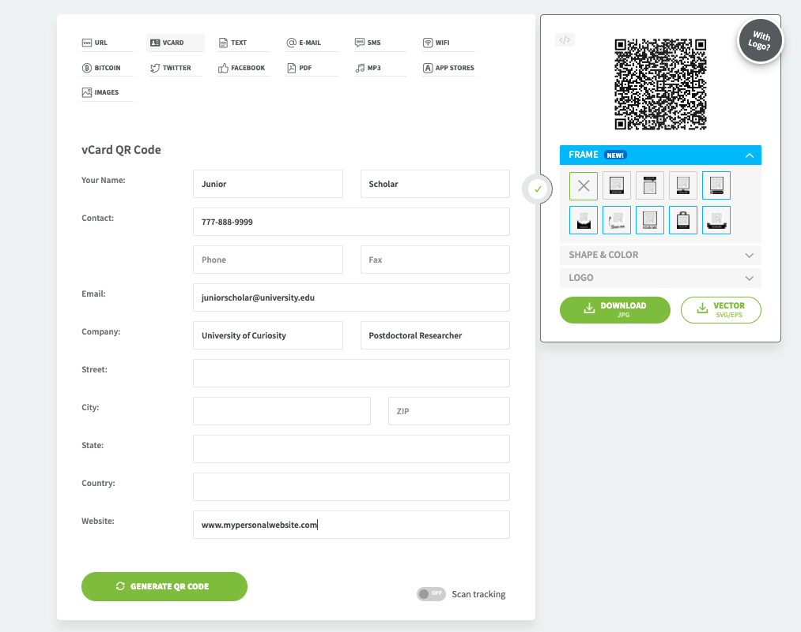

# Make-Apple-Wallet-Business-Card
Instructions to make an Apple Wallet personal business card for sharing at conferences etc.

## Step 1: Generate a QR Code that contains your contact details.
You can likely use other websites to generate a QR code, but this is the website I used.

1. Visit https://www.qr-code-generator.com/
2. Select VCARD.
3. Enter your information.
4. Keep this website open with the generated QR code while you perform the next steps.

## Step 2: Make Apple Wallet Card.
Go to your smartphone now to complete these steps. These are for iPhones.
1. Download "Wallet Creator" on the app store.
2. Click the + sign to make a new card.
3. Enter Organisation Name.
4. Select background colour, label color (text), and values color (text).
5. In header, enter your name "Junior Scholar".
6. In label field, enter your position "Postdoctoral Researcher".
7. In value field, enter your company "University of Curiosity".
8. Click the + to add additional fields.
9. Enter your email and/or phone number.
10. Click the + to select "Barcode".
11. Point your camera at the QR code you generated in Step 1 above.
12. Click the check mark at the top left to make the card.
13. Click the ticket beside the header field to add a logo if you want.
14. Add to your Apple wallet. Now when people scan the QR code, it will ask if they want to add you as a contact.
